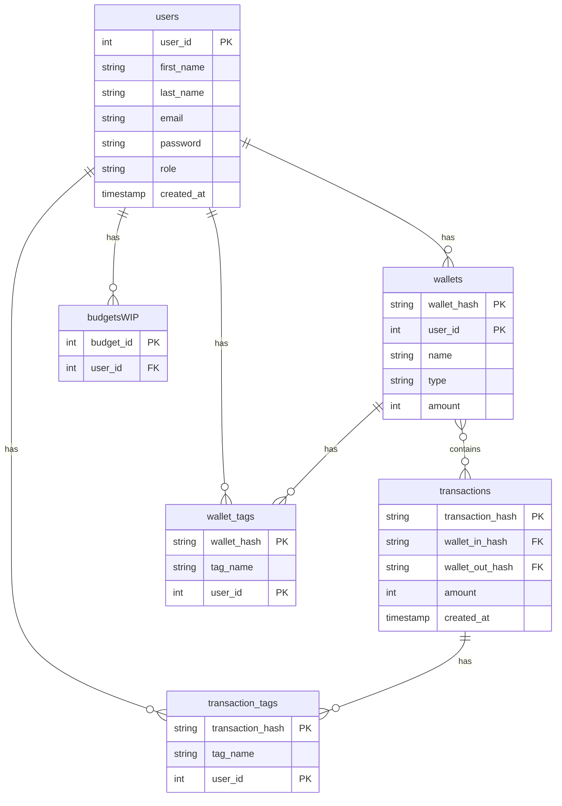

```mermaid
erDiagram
    users ||--o{ wallets : has
    users {
        int user_id PK
        string first_name
        string last_name
        string email
        string password
        string role
        timestamp created_at
    }
    wallets }o--o{ transactions : contains
    wallets {
        string wallet_hash PK
        int user_id PK
        string name
        string type
        int amount
    }
    transactions {
        string transaction_hash PK
        string wallet_in_hash FK
        string wallet_out_hash FK
        int amount
        timestamp created_at
    }
    users ||--o{ wallet_tags : has
    wallets ||--o{ wallet_tags : has
    wallet_tags {
        string wallet_hash PK
        string tag_name
        int user_id PK
    }
    users ||--o{ transaction_tags : has
    transactions ||--o{ transaction_tags : has
    transaction_tags {
        string transaction_hash PK
        string tag_name
        int user_id PK
    }
    users ||--o{ budgetsWIP : has
    budgetsWIP {
        int budget_id PK
        int user_id FK
    }
```
