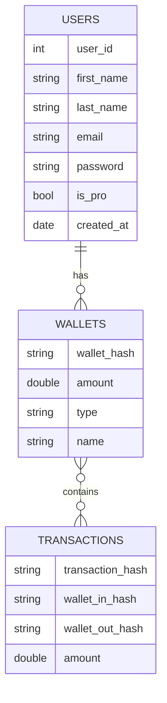

```mermaid
erDiagram
    USERS ||--o{ WALLETS : has
    USERS {
        int user_id
        string first_name
        string last_name
        string email
        string password
        bool is_pro
        date created_at
        
    }
    WALLETS }o--o{ TRANSACTIONS : contains
    WALLETS {
        string wallet_hash
        double amount
        string type
        string name
    }
    TRANSACTIONS {
        string transaction_hash
        string wallet_in_hash
        string wallet_out_hash
        double amount
    }
```
