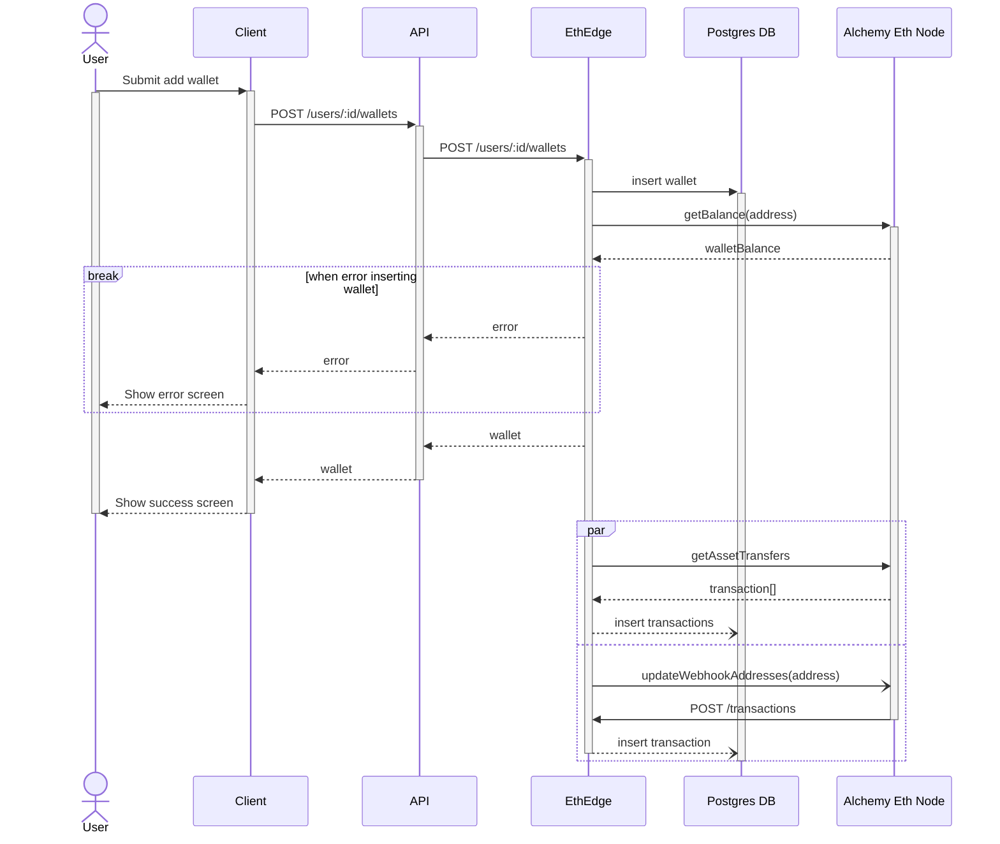

```mermaid
sequenceDiagram
    actor User
    participant Client
    participant API
    participant EthEdge
    participant Postgres DB
    participant Alchemy Eth Node
    
    User->>+Client: Submit add wallet
    activate User
    Client->>+API: POST /users/:id/wallets
    API->>+EthEdge: POST /users/:id/wallets
    EthEdge->>+Postgres DB: insert wallet
    
    EthEdge->>+Alchemy Eth Node: getBalance(address)
    Alchemy Eth Node-->>EthEdge: walletBalance
    
    break when error inserting wallet
        EthEdge-->>API: error
        API-->>Client: error
        Client-->>User: Show error screen
    end
    
    EthEdge-->>API: wallet
    API-->>-Client: wallet
    Client-->>-User: Show success screen
    deactivate User
    
    par
        EthEdge->>Alchemy Eth Node: getAssetTransfers
        Alchemy Eth Node-->>EthEdge: transaction[]
        EthEdge--)Postgres DB: insert transactions
    and
        EthEdge-)Alchemy Eth Node: updateWebhookAddresses(address)
        Alchemy Eth Node->>-EthEdge: POST /transactions
        EthEdge--)-Postgres DB: insert transaction
    end
    
    deactivate Postgres DB
```
